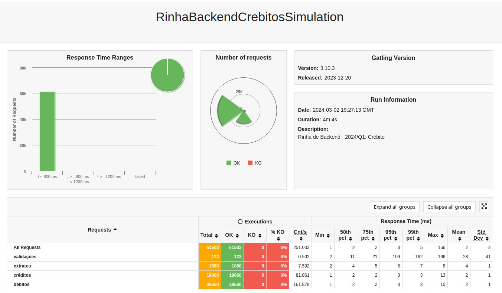

# Rinha de Backend - 2024/Q1

## Tecnologias

- Docker
- Go 1.22
  - mux
  - pgxpool
- Postgres 16
- Nginx

## Repositório

- [Repositório da api](https://github.com/erikyami/rinha-backend-go-2024-01)

## Resultado

## Autor

- Erik Silva
[@eriksilva](https://twitter.com/eriksilva) @ twitter
